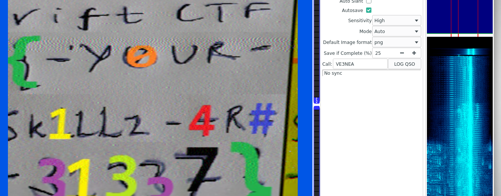

# Forensics 0x0004

## Solución

En este reto se nos daba un archivo llamado razorgirl.mp3 el cual procedí
a abrir con Audacity para observar su espectograma.

A primera vista no había nada extraño hasta que después del minuto 3 
la canción empezó a cambiar y se escuchaba una interferencia de fondo, misma
que reconocí al instante por la experiencia que he obtenido en otros CTFS.

Así que supe que debía utilizar QSSTV, un programa para recibir y transmitir
SSTV y HAMDRM, a veces llamado DSSTV, de esta forma podía convertir un audio
dada una señal en una imagen.

Después de poner el audio y abrir QSSTV pude generar la imagen que tenía la flag.

