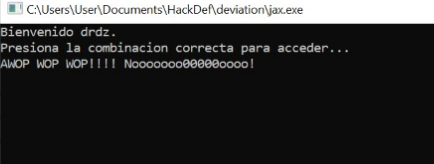
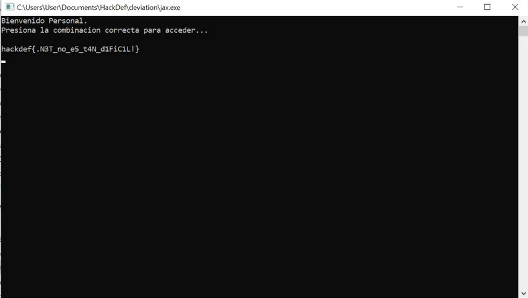

# Deviation
# Resuelto por drdz
### Descripción del reto

> Si entras con el usuario correcto e introduces la combinacion, el programa te imprimira la flag

------

##### Identificando el archivo

Despues de leer la descripcion del reto, descargamos el archivo que se nos entregaba (jax.exe). Ejecutamos el comando de `file jax.exe` para saber como proceder con el reto.


Es un archivo **PE32 executable, hecho en .net**, para Windows. Nos cambiamos de sistema operativo, y empezamos a investigar el archivo.
Ya en Windows, ejecutamos el programa para ver como reacciona



Eso sucedio con todas las teclasa que intentamos. Al principio se penso que podriamos intentar con un poco de fuerza bruta, a ver que conseguiamos, pero decidimos primero descompilar el program para conocer mejor cómo es el flujo de su ejecución.

Al ser un programa hecho en .net, descompilamos el programa con [dnSpy](https://github.com/0xd4d/dnSpy), un assembly editor especial para .net


Observando el codigo fuente podemos ver que si presionamos: **F5 + F3 + F6**, se inicializa una clase Flag, tomando como parametro el usuario de nuestra computadora. Hacemos otro intento, ejecutando el programa y introduciendo la combinacion, el programa ya no regresa 'WOOP WOOP....' pero aparentemente regresa basura

Al revisar el codigo de la clase Flag:

```C#
using System;
using System.IO;

namespace jax
{
	// Token: 0x02000002 RID: 2
	internal class Flag
	{
		// Token: 0x06000001 RID: 1 RVA: 0x00002050 File Offset: 0x00000250
		public Flag(string _f)
		{
			try
			{
				File.ReadAllText(_f.ToCharArray()[8].ToString());
				this.s = "hackdf{NOP_ESTO_NO_ES_LO_QUE_BUSCAS!}";
			}
			catch (Exception e)
			{
				this.l(e, _f);
			}
		}

		// Token: 0x06000002 RID: 2 RVA: 0x000020A4 File Offset: 0x000002A4
		private void l(Exception e, string _f)
		{
			string message = e.Message;
			this.s = "";
			Console.WriteLine(this.s);
			if (e.GetType() == typeof(IndexOutOfRangeException))
			{
				string text = this.f(_f);
				long num = 137438953472L;
				int[] array = new int[]
				{
					-47,
					-86,
					-107,
					-101,
					-83,
					-41,
					-80,
					-82,
					13,
					9,
					-22,
					-82,
					-68,
					-81,
					-91,
					-49,
					-80,
					-80,
					-71,
					-87,
					-30,
					0,
					-36,
					-97,
					-12,
					-61,
					-101,
					-67,
					-94,
					-75,
					-26,
					-15
				};
				char[] array2 = message.ToCharArray();
				char[] array3 = text.ToCharArray();
				while (((long)this.s.Length & num) == 0L)
				{
					byte b = Convert.ToByte(array2[this.s.Length]);
					b ^= (byte)((int)Convert.ToByte(array3[this.s.Length % 8]) + array[this.s.Length]);
					this.s += Convert.ToChar(b).ToString();
					num >>= 1;
				}
				return;
			}
			Console.WriteLine("Nop, esa no es la excepcion correcta");
		}

		// Token: 0x06000003 RID: 3 RVA: 0x0000219E File Offset: 0x0000039E
		public string print()
		{
			return this.s;
		}

		// Token: 0x06000004 RID: 4 RVA: 0x000021A6 File Offset: 0x000003A6
		private string f(string inp)
		{
			if ((inp.Length & 8) <= 0)
			{
				return this.f(inp + "x");
			}
			return inp;
		}

		// Token: 0x04000001 RID: 1
		private string s;

```
Podemos saber como funciona el programa.
Resumidamente, lo  que hace el programa es:

> 1. Tomar el usuario de tu computadora y usarlo para inicializar la clase Flag.
> 2. Dentro de la clase Flag, convierte a tu usuario en un char array y accede a su posicion[8]
> 3. Si el programa avienta una IndexOutOfRangeException() se entra en el metodo l. Aqui es donde se va a construir la flag
> 4. Haciendo operaciones con los arrays que contiene el metodo (se usan 3 arrays, uno creado a partir del mensaje del error, uno creado a partir del usuario, y  > otro que ya tenia el mismo programa), se va creando una variable string s. esta va a ser la que se imprima con el metodo Print() de Flag.

Ya que dentro de las operaciones se utiliza un array creado a partir del usuario, tenemos que encontrar un usuario tal que sus letras, al ser convertidas y utilizadas en la operacion, den un digito que al convertirse en ASCII, sea un valor con sentido. **Tenemos que determinar como conseguir eso**

```C#
          byte b = Convert.ToByte(array2[this.s.Length]);
					b ^= (byte)((int)Convert.ToByte(array3[this.s.Length % 8]) + array[this.s.Length]);
          this.s += Convert.ToChar(b).ToString();
```

Esa es la parte que nos interesa del programa. Esta parte nos dice muchas cosas. Una de las cosas que nos dice, es que el usuario tiene que ser necesariamente de 8 caracteres. No podemos dejar que el programa nos paddee el usuario. Tambien nos dice que b va a ser un byte que al convertir su valor en char, lo concatenaran a s, que es nuestra flag. Es decir, b es cada caracter de la flag.

Tenemos una ventaja, sabemos que las flags tienen formato ***hackdef{***. Esto quiere decir, que las primeras 8 iteraciones de b, van a ser los caracteres de "hackdef{" convertidos en bytes.

*Las primeras 8 iteraciones de b son:*

> [h] b0 = 01101000 = 104
> 
> [a] b1 = 01100001 = 97
> 
> [c] b2 = 01100011 = 99
> 
> [k] b3 = 01101011 = 107
> 
> [d] b4 = 01100100 = 100 
> 
> [e] b5 = 01100101 = 101
> 
> [f] b6 = 01100110 = 102
> 
> [{] b7 = 01111011 = 123

Con la informacion que tenemos, sabiendo que queremos X tal que X sean las iteraciones de los caracteres del usuario correcto, y entendiendo las operaciones que se hacen para asignarle valor a b, podemos reescribir el problema en la siguiente ecuacion:
 

 **b_{i} = ord(arr2_{i}) XOR (X + (arr1_{i}))**


En donde arr2 es el array creado con el mensaje de la excepcion, y arr1 es el array que ya tenia hardcodeado el programa.
Solo es cuestion de despejar X
Hicimos unas iteraciones a mano, y nos dio como resultado: **Per**

Si Jax.exe nos regresa basura, pero que tenga sus primeros 3 caracteres como *hac*, sabremos que lo hemos hecho bien


El programa funciono como lo predijimos. Para conseguir la flag, solo es cuestion de hacer un pequenio [scriptsito](https://github.com/Drdzmtz/hackdef-quals-2020/blob/master/Reversing/Deviation/Solve.py) que nos automatize el proceso y nos regrese el usuario correcto.

El script creado nos regreso el string: **Personal**. Este deberia de ser el usuario correcto. Conociendo el usuario y la combinacion, solo es cuestion de correr el .exe de nuevo:




Yay!, Obtuvimos la flag. n.n
