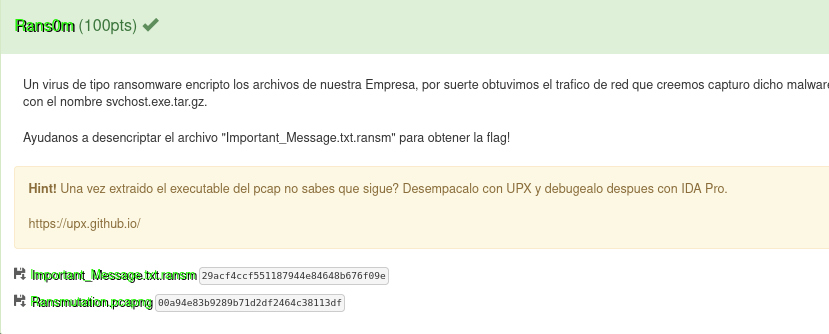
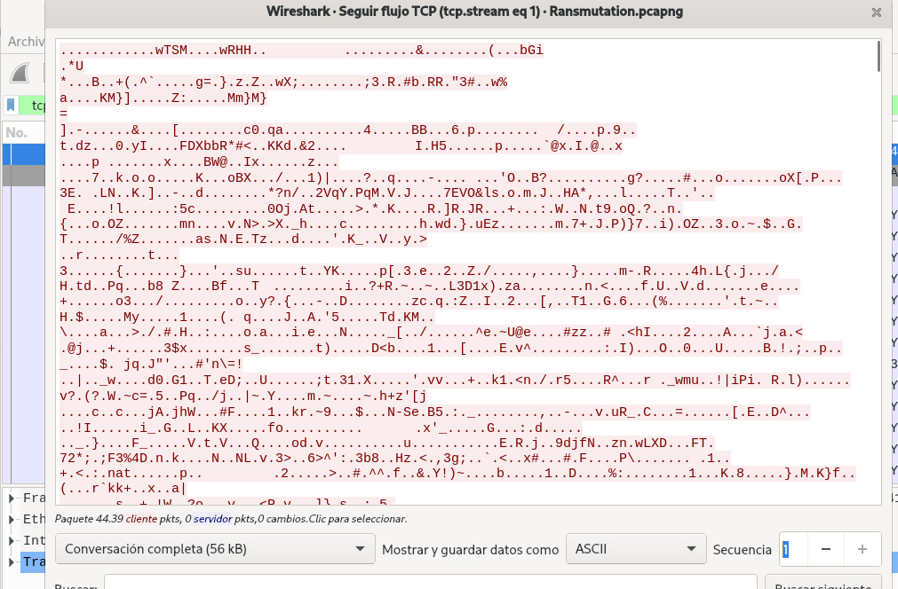
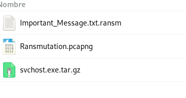
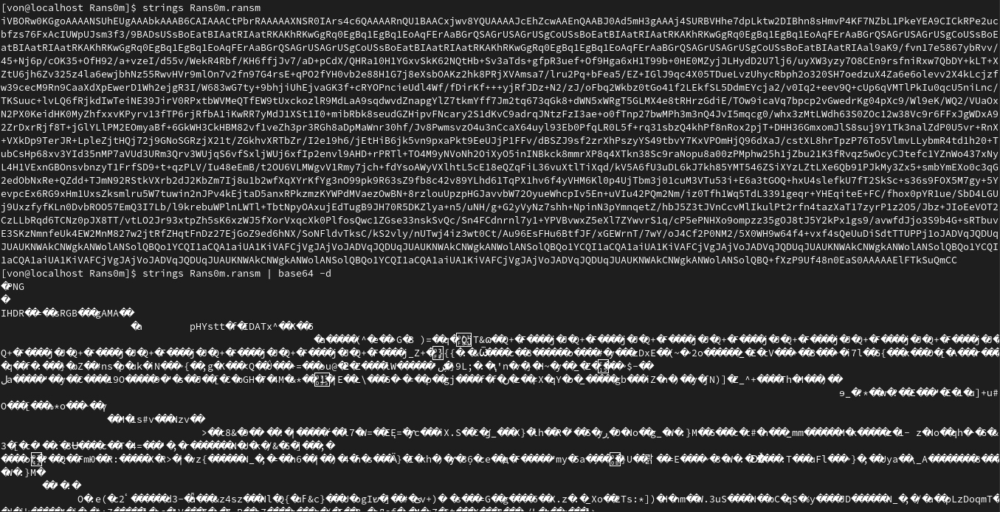

# Rans0m

# Resuelto por V̵O̵N̵

## Descripción del reto

No estoy seguro si resolví el reto como se debería, pero más que alguien que sabe de reversa soy alguien
que se adentró mucho en web y forenses por lo que apliqué mi conocimiento en forenses para resolverlo.

Se nos daban dos archivos para este reto, un .pcapng y un mensaje extraño.

Seguir el flujo TCP siempre es la respuesta haha.

Una vez analizado el .pcapng pude notar que fue interceptado el tráfico cuando se envió el ransomware
por lo que obtuve sus datos crudos y los convertí en un tar ya que la descripción del reto hacía mención de esto.
Una vez que se descomprimía el tar se obtenía el .exe que encriptaba la información por lo que se lo pasé a mi compañero
que estaba en windows para que lo ejecutara y oh gran sorpresa... todo lo que se encontraba en su carpeta de descargas
se encriptó como un ransomware real LMAO SORRY DIEGO HAHAHA, it's quite funny LOL

Fue aquí cuando le pedí que por si acaso me enviara el mensaje original después de que este .exe tocó este archivo para analizarlo.
Y descubrí algo importante, el mensaje que en un inicio parecía basura ahora era un base64 que podía decodificar, así que luego
de decodificarlo noté una estructura conocida que como alguien que le gusta forenses pudo reconocer.
Se trataba de una imagen, así que convertí la información decodificada en base64 a imagen y obtuve la flag.

