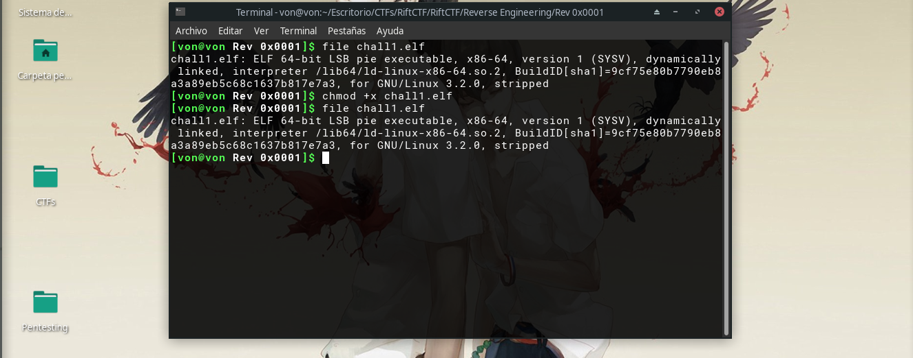
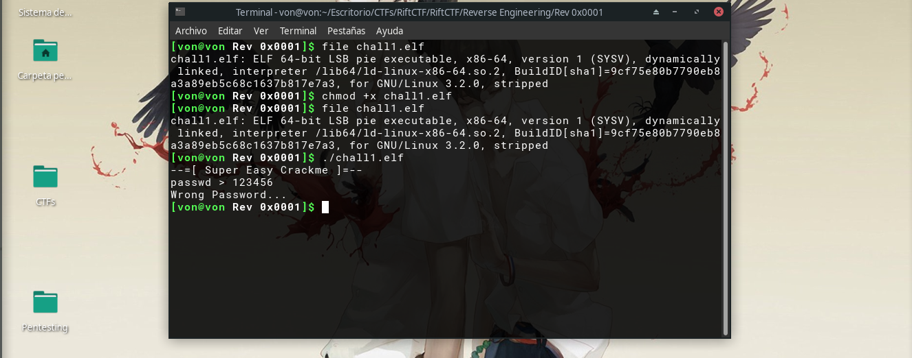

# Rev 0x0001

## Solución

En este reto se nos daba un archivo llamado chall1.elf, un archivo ejecutable.
Por lo que primero que hice fue darle permisos para poder ejecutarlo.

Después de ejecutarlo me pidió una contraseña así que ingresé cualquier cosa
para ver la salida.

Al final decidí utilizar strings para traer el contenido dentro de este
y encontré la flag. 

Decidí ejecutar de nuevo el programa y poner la flag para comprobar
que sí era la contraseña correcta dando como resultado que sí era la flag
correcta.

