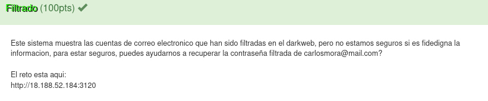
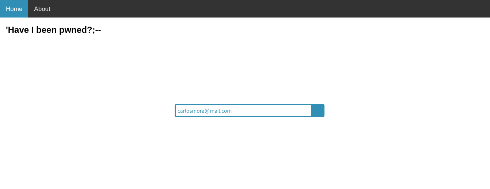
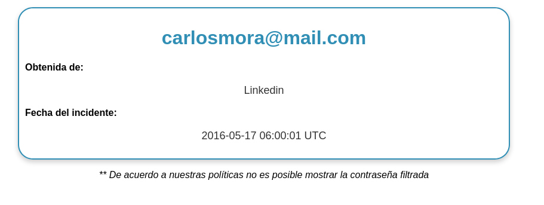
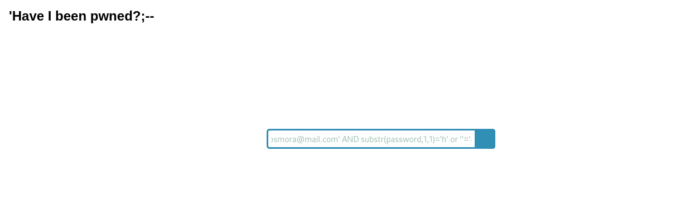

# Filtrado

# Resuelto por V̵O̵N̵

## Descripción del reto

En este reto nos pedían obtener la contraseña de un correo, y si tomamos en cuenta las finales del hackdef del año pasado
era claro que se trataría de un reto de sql injection.
Así que el primer paso fue observar cómo funcionaba la página.

Después de ingresar el correo, si este había sido pwneado te daba su información general.
En cambio, si este no había sido pwneado te mostraba el siguiente mensaje: "Hey!! No te han pwneado :)".

La sql injection que construí se basa en utilizar substr, una función de sqlite para obtener caracteres de un string
dado un inicio y un fin, así que conociendo que el formato de flags era "hackdef{aQu1_v4_l4_Fl4g}" bastó con intentar
que el primer caracter de la contraseña sería la "h", en caso de ser así nos retornaría la información general del usuario pues tanto el usuario que era la primer condición como el primer caracter contraseña de su contraseña eran verdaderas. En caso de que
el caracter de la contraseña no fuera el correcto nos regresaría un "Hey!! No te han pwneado :)" lo cual sería muy útil al momento
de automatizar esta tarea.

A partir de aquí lo único que fue necesario fue realizar un script en python para automatizar las cosas y que fuera recorriendo
toda la contraseña hasta obtenerla y fue así como obtuvimos la flag.

