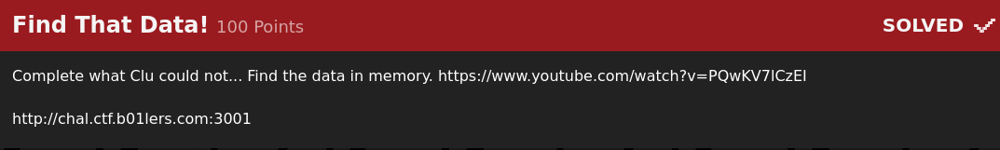
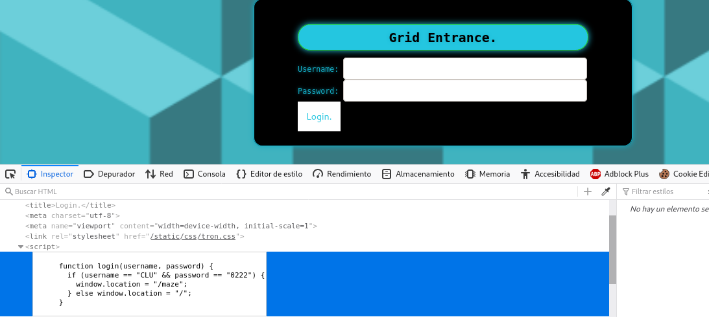
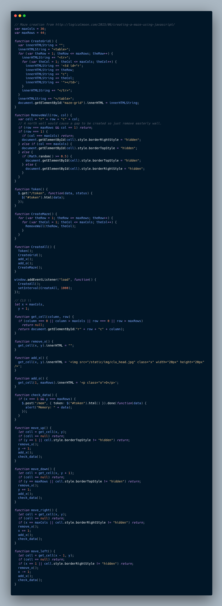
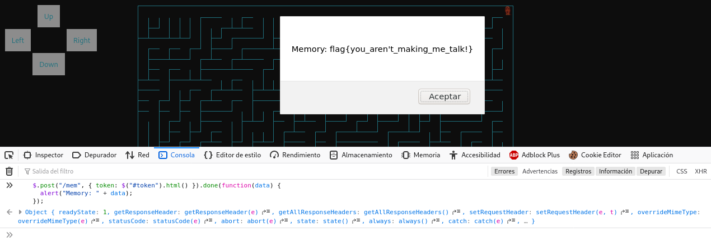

# Find That Data

En este reto nos encontramos con una página web con un inicio de sesión.
Fue bastante fácil descartar opciones como sql injection pues al observar el tráfico de la red
al realizar el formulario no se enviaba ninguna http request así que sabía que la verdadera lógica se encontraría
en el lado del cliente, una debil validación por parte del cliente. De esa forma logré "iniciar sesión"
y fui reedirigido al verdadero reto.

Este reto consistía en un laberinto en el que te podías mover por él con las acciones de la izquierda, y al parecer,
una vez habiendo llegado al otro extremo obtendrías la flag.
Había varias formas de resolverlo pero me fui por la más sencilla así que dejaré aquí abajo la imagen con el script original
del reto.

Por mera lógica busqué la flag en el script, sin embargo, no la encontré así que supuse que esta sí se obtenía
de una petición por lo que busqué las líneas de código donde se realizaran peticiones encontrando así
la siguiente función.

La función tenía una condición donde validaba que ya hubieras llegado al extremo del laberinto, pero si tomamos en cuenta
lo largo que era el código del laberinto y que este se movía cada determinado tiempo al ir cambiando sus paredes decidí
tomar la opción más sencilla posible lol... sólo ejecuté la petición por mi parte en el cliente sin usar toda la función
pues esta sí validaba la posición, y es que es fácil notar que no enviaba la posición al back-end, sólo enviaba el token
así que sabía que no hacía falta realmente llegar al extremo del laberinto para resolverlo.

De esta forma obtuve la flag.

