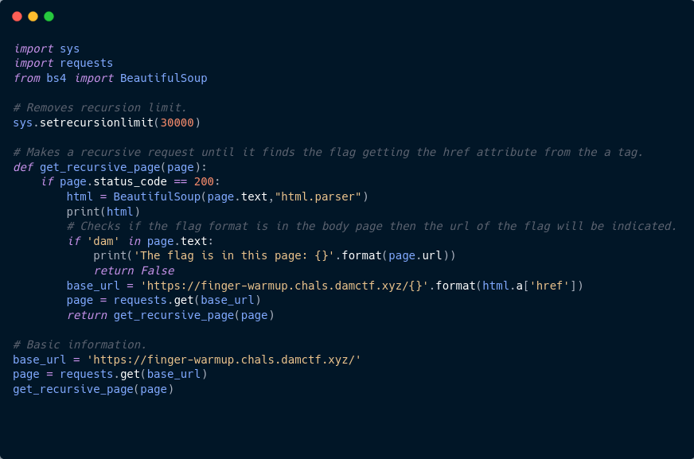

# Finger Warmup

En este reto nos encontramos con una página web con tan sólo un link que nos lleva a otra dirección.

Después de ser reedireccionado notamos que el proceso se repite, y no hablo de una vez sino de cientos de veces.
Así que para acelerar el proceso utilicé BeautifulSoup y algo de recursividad para navegar a través de todas
las páginas y buscar la flag en caso de que esta se encontrara en alguna de ellas.

Utilizando requests de Python obtuve el HTML (texto) de la página y mediante BeautifulSoup creé objetos de este HTML para poder acceder al atributo href del tag a el cual indicaba cuál sería la siguiente url que visitaríamos.

Script recursivo para que navegara a través de todas las páginas.

Fueron cientos de peticiones las que se realizaron recursivamente.

Hasta que en una de ellas encontré la flag : ) algo tricky pero python siempre las puede

