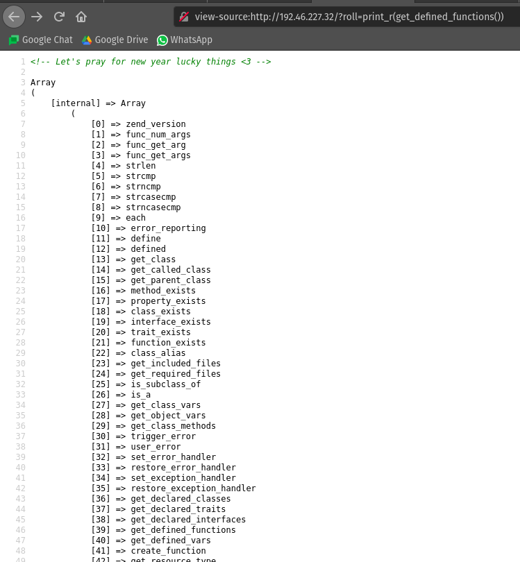
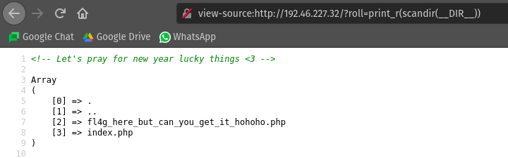
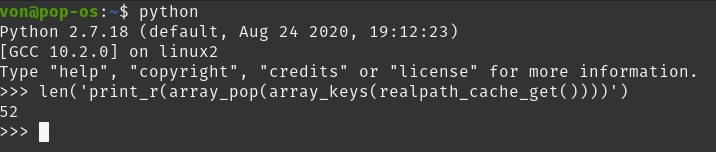
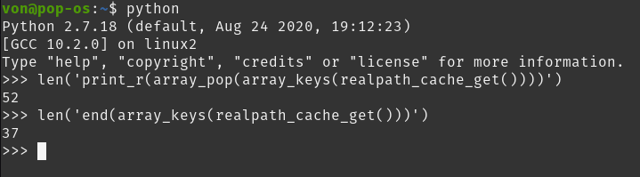
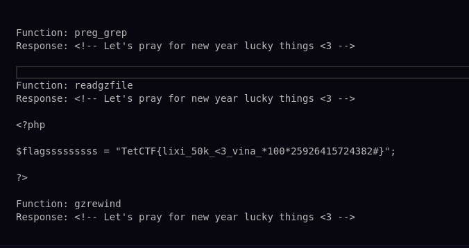

# HPNY

## Descripción del reto

```

Get some lucky word or number for your new year!
http://192.46.227.32/?roll=get_lucky_word
```

## Solución


En este reto nos daban la URL de un sitio web en el que al entrar obtenías un mensaje de feliz año nuevo en diferentes idiomas cada vez que refrescabas el sitio.
De entrada no había nada sospechoso, sin rastros de robots.txt, scripts, cookies, etc, por lo que procedimos a ingresar al sitio sin ningún parámetro en la URL http://192.46.227.32/ y obtuvimos la siguiente salida.


Aquí se encontraban dos funciones bastante aleatorias por lo que no les prestamos atención.
También había un condicional en el que si no obtenía el parámetro roll mediante el verbo GET
nos mostraría el código fuente de la constante __FILE__ la cual indicaba index.php.

En caso de no entrar al condicional nos toparíamos con el primer reto técnico, una expresión regular
que sólo permitía letras minúsculas de la a hasta la z, guión bajo y un punto, esta venía del parámetro roll mediante el verbo GET además de que lo que llegara por el parámetro no debía exceder una longitud de 50.

Si no cumplíamos con esta condición de la expresión regular entonces no llegaríamos a lo más importante, el eval, el cual
evalúa la expresión que se le pase como parámetro siendo esta una de las funciones más peligrosas si cae en las manos incorrectas.



Gracias a la pista del reto deducimos que utilizando la función get_defined_functions podríamos obtener todas las funciones definidas que podríamos utilizar y mediante print_r mostramos el arreglo de funciones al ser evaluado una vez pasada la expresión regular.

En este punto estuvimos perdidos bastante tiempo pues desconocíamos cuál de las 1116 funciones del arreglo nos ayudarían a obtener la bandera, así que optamos por primero encontrar la manera de saber si en el directorio de ese proyecto habían más archivos además del index.php, así fue como llegamos a la función scandir la cual devuelve un arreglo con los ficheros y los directorios que se encuentran bajo el directorio que se le pase como argumento, sin embargo, no iba a ser tan sencillo ya que la expresión regular no nos iba a permitir introducir comas, comillas, variables, etc, así que después de mucho tiempo se nos ocurrió que si existía la constante __FILE__ la cual retornaba /var/www/html/index.php entonces existiría la constante __DIR__ retornando así /var/www/html, hubiese sido más sencillo escribir directamente '/var/www/html' pero la expresión regular lo impedía, así que haciendo esto obtuvimos la lista de archivos del directorio.



De esta forma sabíamos que había un archivo llamado fl4g_here_but_can_you_get_it_hohoho.php oculto que contenía la bandera, pero no pudimos acceder a él pese a que sabíamos su ruta ya que no mostraba nada por lo que procedimos a encontrar una función que pudiera leer el archivo pero había un gran problema, antes de usar una función que leyera archivos mediante la ruta de uno, teníamos que lograr que el arreglo que nos retornó scandir fuera sólo un string con la ruta fl4g_here_but_can_you_get_it_hohoho.php pero el arreglo tenía este string en la posición 2 y debido a la expresión regular era imposible usar corchetes o números ya que sólo permitía letras así que acceder al arreglo como scandir(__DIR__)[2] no sería posible.


Aquí llegamos a la parte más interesante del reto en donde Lupita encontró una función increíble para solucionarlo y hablo de la función realpath_cache_get que regresa las rutas de las entradas de la caché.

Es importante mencionar que era necesario visitar la página fl4g_here_but_can_you_get_it_hohoho.php para que esta fuera guardada en el CACHÉ y así se insertará sola en el arreglo que retorna esta función, de lo contrario nunca aparecería en este y sería imposible resolver el reto.

Como se puede ver en la imagen el resultado obtenido era similar a scandir, sin embargo, este retornaba un arreglo de arreglos, y también a diferencia de scandir también retornaba fl4g_here_but_can_you_get_it_hohoho.php en la última posición del arreglo (gracias al caché) por lo que mediante la función array_pop el cual regresa el último elemento de un arreglo Lupita obtuvo el arreglo que contenía fl4g_here_but_can_you_get_it_hohoho.php pero aún había un problema, seguíamos teniendo un nuevo arreglo y era imposible acceder a sus posiciones...


Hasta que mediante la función array_keys pudimos obtener la llave del arreglo asociativo obteniendo fl4g_here_but_can_you_get_it_hohoho.php y ya teníamos el puro string 'fl4g_here_but_can_you_get_it_hohoho.php' listo para ser usado con alguna otra función que pudiera leer el contenido de un archivo y mostrar su contenido, pero teníamos un nuevo problema...




Ya habíamos excedido la longitud de 50 por lo que no cumplíamos el condicional y no nos permitiría ejecutar nada así que Lupita encontró una función llamada end() la cuál retornaba el valor de la última posición del arreglo y al ser más corta nos daba más margen para escribir una nueva función.


Ahora sólo era cuestión de automatizar las cosas así que mediante GO hicimos que ejecutara todas las funciones que su nombre tuviera una longitud menor o igual a 11 caracteres ya que nuestro string medía 37 y no podíamos pasarnos de 50 ya que
37+11=48+2=50 donde esos 2 son los parentesis que abren y cierran de la nueva función.



De esta forma dimos con la función readgzfile la cual lee un archivo, lo descomprime y lo escribe en la salida estándar obteniendo así la bandera.




