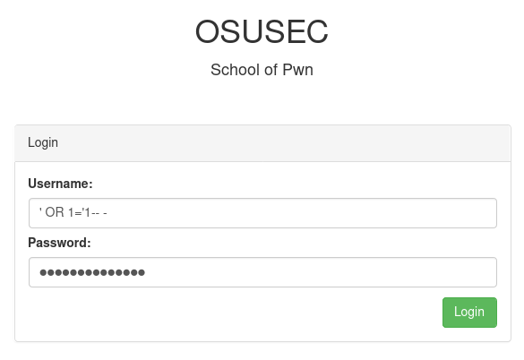
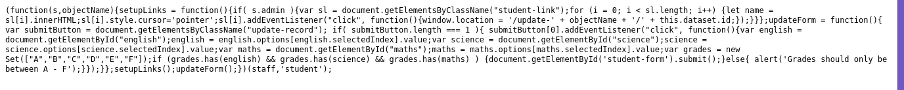
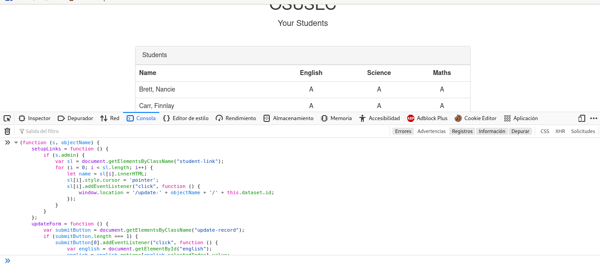

# Hacker Camp

En este reto tenemos que burlar el sistema de una universidad para poder cambiar las calificaciones de una alumna en particular.

De entrada nos topamos con un inicio de sesión el cual fue bastante fácil de burlar con el clásico ' OR 1='1-- -,
de esta manera iniciamos sesión como un maestro.

Una vez dentro empecé a buscar a la alumna que queríamos ayudar, sin embargo, no tuve suerte. Así que se me ocurrió algo,
volví a iniciar sesión pero en lugar de utilizar ' OR 1='1-- - utilicé ' OR id='1-- - y fui variando el id para iniciar sesión
con las cuentas de diferentes maestros para ver si alguno de estos tenía registrada a la alumna que queríamos ayudar, sin embargo,
tampoco tuve suerte así que supuse que se haría de diferente manera.

Una vez dentro encontré una variable de configuración en la que se indicaba si el usuario era administrador, misma que sería de utilidad después por lo que aproveché para modificar el valor.

También me encontré con un script el cual después de identarlo correctamente era el siguiente.

El script es bastante sencillo, es una immediately invoked function expression de javacript, son funciones que se ejecutan en cuanto son
creadas. Esta recibía el objeto que mostré anteriormente y validaba si este era administrador, en caso de serlo le agregaba un event listener a cada alumno registrado, y una vez que era clickeado te enviaría a una ventana donde podrías modificar sus notas por lo que
una vez modificado mi objeto sólo mandé a llamar de nuevo esta función para poder modificar a voluntad lo que necesitaba.

En este punto sólo debía modificar las calificaciones, sin embargo, aún no tenía a la alumna que quería ayudar así que buscando por el sitio me topé con algo interesante, en la URL había un base64, después de decodificarlo noté que se trataba del usuario del alumno al
que le podía modificar las calificaciones por lo que utilizando la misma estructura codifiqué un base64 con el usuario Natasha_Drew.

¡Funcionó! Ya sólo era necesario cambiar sus calificaciones.

De esta forma vulneré todo el sitio y obtuve la flag.

