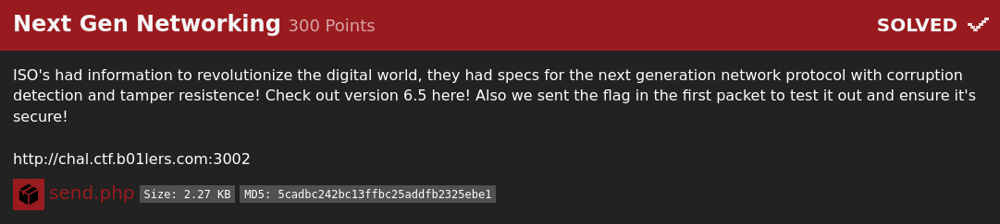
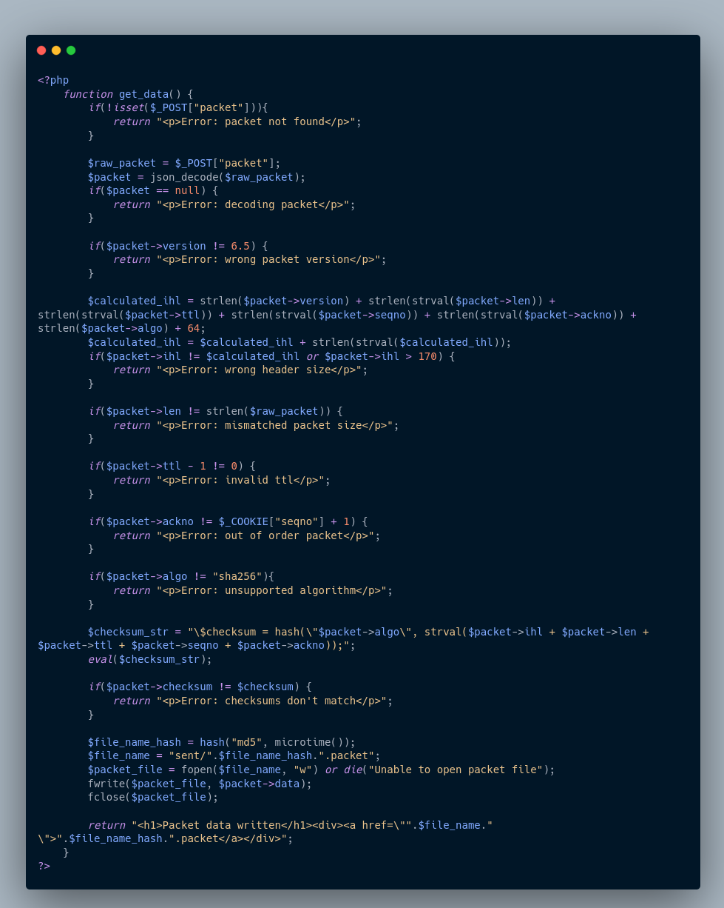
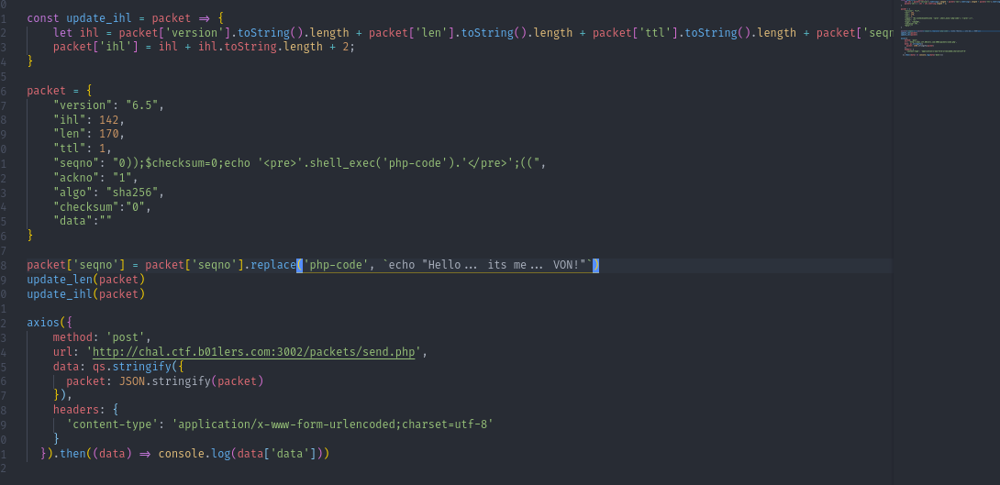
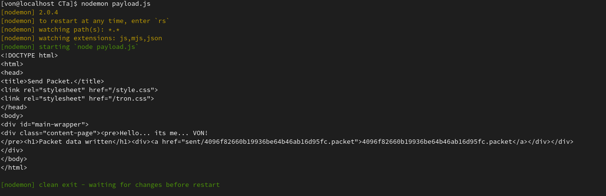
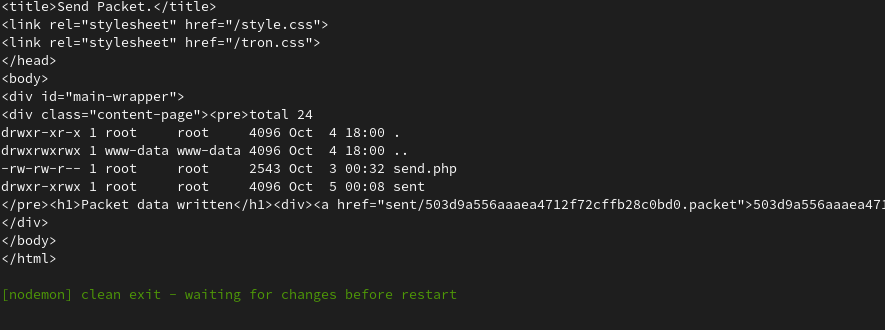
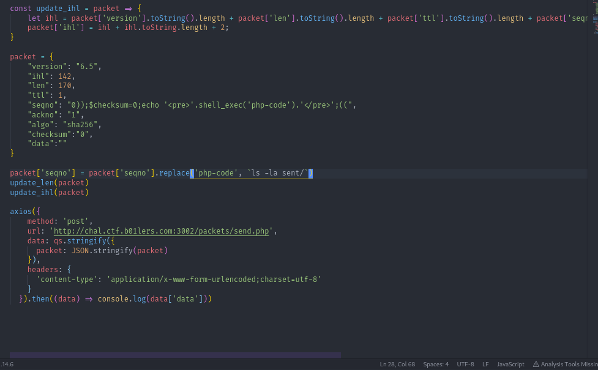
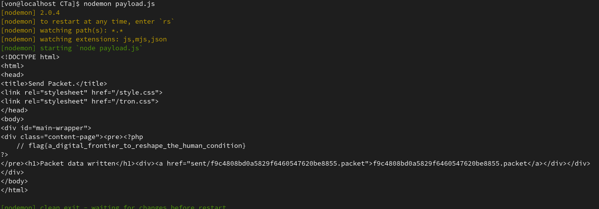

# NExt Gen Networking

Este reto fue muy complicado para mí pero logré resolverlo siendo este el último reto web del evento. Sólo el 4% de equipos de todo el CTF lograron resolverlo habiendo más de 900 equipos, sin embargo, aproveché para crear mi primer payload utilizando NodeJS pues mi meta es dejar Python para pasarme de lleno a javascript en lo que termino mi aprendizaje de GO.

En este reto nos daban el código fuente de la página y lo que tenías que hacer era crear un paquete
dadas las condiciones que se te mostraban. Fue un trabajo bastante laborioso ir cumpliendo cada una
de las condiciones, sin mencionar que debías tener conocimientos de PHP pues se utilizaba json_decode, strlen, strval, etc.

El punto del reto era explotar el EVAL que se encontraba hasta el final del código para poder ejecutar código de forma arbitraria cortando el string para poder crear el código que necesitaras, sin embargo, era importante seguir tomando en cuenta cada
condición para que pudieras llegar hasta ahí, al final creé este payload para poder llegar hasta el eval y ejecutar todo
lo que necesitaba obteniendo así la flag.

Por cierto, si es que se lo preguntan no sé hasta donde tenía poder en el servidor, quizá podía borrar archivos, quizá no, quizá con una reverse shell podía escalar privilegios, no lo sé, sin embargo, el punto de estos retos una vez que te haces con el servidor no es el de sabotear a los demás competidores para que lo tengan en cuenta.

Lo que te mostraré abajo fueron los comandos que utilicé además de la respuesta que me daba el servidor. 
No olvides que dejaré el código fuente de la página además del payload que creé en Node para poder resolverlo.

