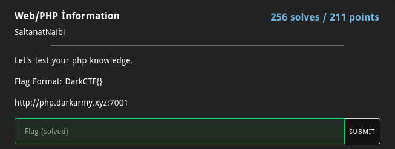
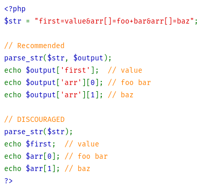
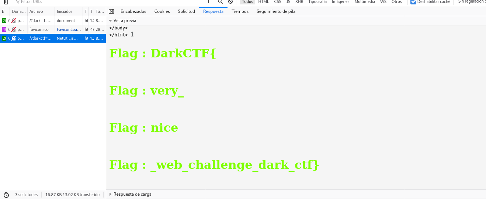

# Php-information

Por lo general no me gustan este tipo de retos pues más que verlo como algo relacionado a la seguridad informática
me parece más un reto sobre como debugear una página, peor aún cuando se trata de PHP, sin embargo, pude rescatar
tres puntos muy importantes... el user-agent, parse_str() y la colisión de hashes o hashes mágicos.

No entraré en detalle con la página, el reto consiste en entrar a cada condicional para ir imprimiendo las partes de la flag.

La única forma de resolver este reto fue gracias a la documentación de PHP pues es de suma importancia saber cómo funciona parse_str pues es la base del reto, una vez habiendo entendido esta función fue muy fácil entrar a los condicionales.

Aquí les dejaré la consulta completa cumpliendo con cada condicional, es importante notar que hay que modificar el user-agent
para obtener el resultado esperado.

User-Agent: 2020_the_best_year_corona
http://php.darkarmy.xyz:7001/?darkctf=2020&ctf2020=WkdGeWEyTjBaaTB5TURJd0xYZGxZZz09&karma=QLTHNDT&2020=QNKCDZO

Ahora explicaré un poco la parte más importante del reto para mí, dejando de lado el como crear un array asociativo con parse_str o codificar/decodificar un base64.

Para cumplir la última condición era necesario que dos parametros GET (karma y 2020) tuvieran diferente valor, y después
que esos valores al ser evaluados mediante MD5 tuvieran el mismo valor, y aún cuando sé que suena algo contradictorio
esto se trata de un reto de colisión de hashes o hashes mágicos. Son dos valores que al evaluarse en este caso mediante MD5 tienen el mismo valor, las probabilidades son bajas así que busqué una lista para ir probando diferentes valores hasta conseguirlo con los dos valores enviados en la URL que mostré previamente.

Así después de entrar en varias condiciones logré obtener la flag.

