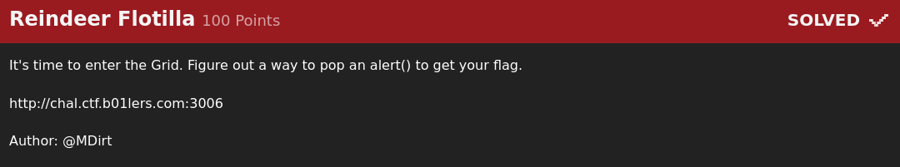
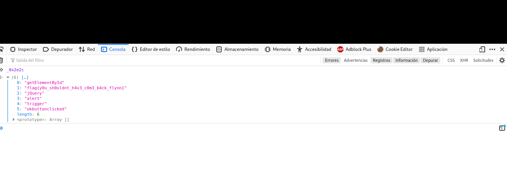

# Reindeer Flotilla

Este reto fue sencillo pero interesante pues te permite aprender cómo desofuscar código de javascript para que sea más entendible
cuando usan este tipo de ofuscamiento.

Al encontrar el script con el que podía escribir en la pantalla me topé con un arreglo bastante "extraño", sin embargo,
gracias a otros CTFS supe cómo obtener la información de manera más entendible. Bastó con copiar el nombre del arreglo
en la consola del navegador en la página para obtener los valores en un formato mucho más entendible sin tener que
decodificar nada por mi parte.

