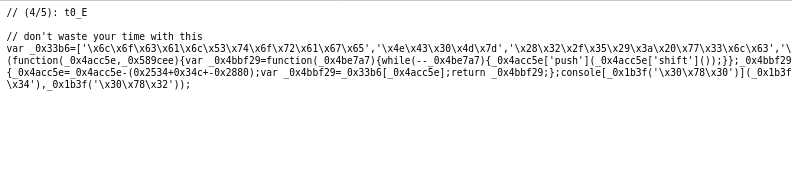

# Reindeer Flotilla

En lo personal detesto este tipo de retos pues más allá de sólo aportar el aprender
a inspeccionar los elementos no aporta nada valioso. Este reto consiste en ir obteniendo
las partes de las flag de los diferentes archivos que puedes encontrar.

