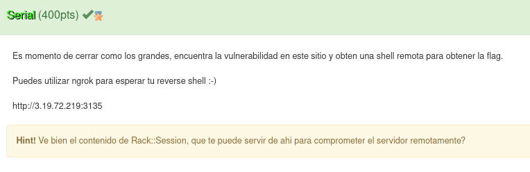
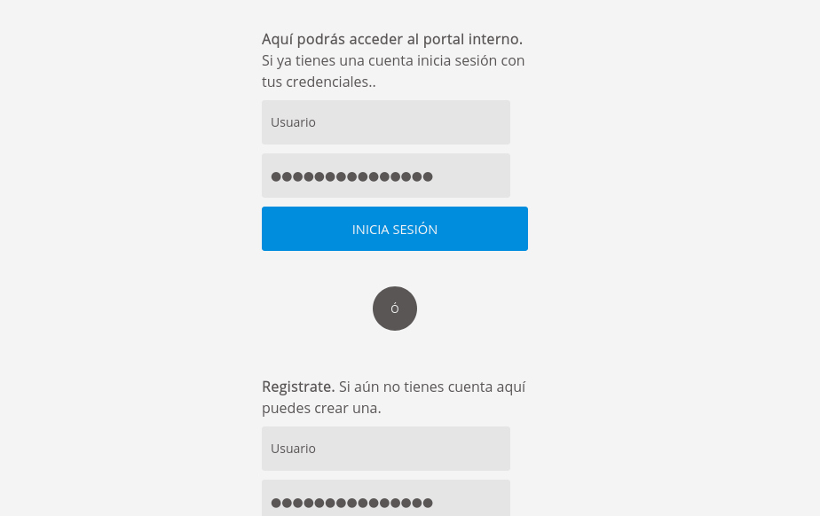
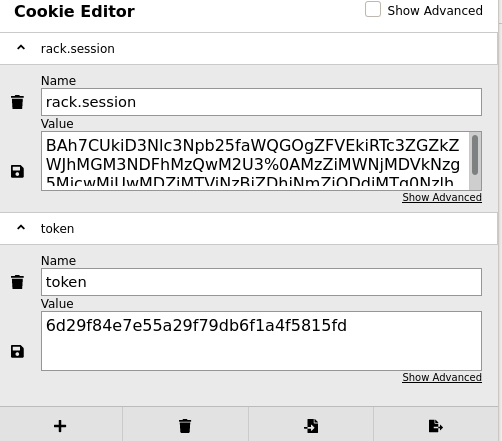
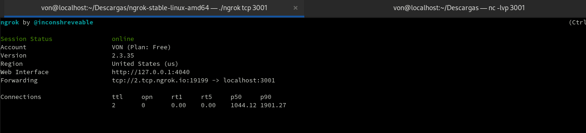
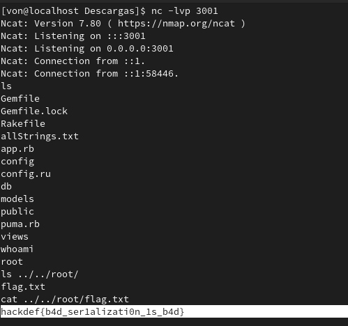

# Serial

# Resuelto por V̵O̵N̵

## Descripción del reto

Este reto fue por lejos el más difícil, y con justa razón sólo 3 equipos de todo el evento logramos resolverlo. En
este reto logré obtener el top 3 al ser de los primeros 3 en resolverlo así como en fisgón obtuve el top 2.

Algo que me gustaría mencionar es que todos los retos web de este CTF excepto por el de exfil fueron realizados en ruby
utilizando sinatra, y aún cuando como desarrollador web he usado una variedad de lenguajes y frameworks la verdad es que
ruby me tomó por sorpresa, peor aún con un framework del que jamás había escuchado hablar. Volviendo al reto... 

La página principal te permitía registrarte e iniciar sesión con dicho usuario.
Elaboré un montón de teorías sobre cómo se resolvía el reto, desde un tema relacionado a firmar tu propia cookie
hasta template injection en ruby, sin embargo ninguna parecía funcionar.

Aquí me faltó adjuntar una foto porque olvidé sacarle captura pero básicamente lo que hice fue romper la página.
En este punto habían dos casos, si pedías la información de un usuario que existía dado su id te sacaba de la página
porque no coincidía el token, sin embargo la sesión y el token no se destruían.
En el otro caso si pedías la información de un usuario que no existía, por ejemplo, el id 1000000, la página se rompía
y el debuger te daba información delicada que no debía darte, aquí es donde la hint del reto fue de utilidad pues hablaba
de Rack:Session, ¿y qué se encontraba aquí? un dato muy interesante llamado secret, el cual, después de investigar bastante
de un reto de la Defcon del 2013 noté que permitiría firmar cookies, y fue aquí cuando perdí bastantes horas creyendo
que el id número 1 sería el del administrador y que si suplantaba su cookie y token basado en el secret que ya conocía
podía hacerme pasar por él y quizá tendría un panel especial donde se mostraría la flag, pero oh... gran sorpresa, no iba por ahí.

Después de investigar encontré que se podía ejecutar código remoto si se sabía el secret del servidor, mismo que ya sabía,
así que utilizando metasploit pude ejecutar el payload que me permitió tomar el control del servidor y así pude navegar entre
todos sus archivos leyendo la información de estos.

Me tomó por sorpresa ya que no me había tocado tener que utilizar metasploit hasta la fecha para resolver algún reto de algún CTF
pero tomando en cuenta que la descripción del reto hablaba de una reverse shell y el payload te brindaba esto como resultado tenía sentido, además siendo esta mi última esperanza no había nada que perder así que preparé ngrok para tener una ip publica esperando 
la reverse shell junto con netcat para estar a la escucha de este payload.

Hice varios intentos sin éxito cuando empecé el reto, sabía que el administrador entraría cada cierto tiempo a iniciar sesión en la página pero pensé que se trataba más de un reto en el que tenías que robar las cookies del administrador para robarle la sesión
y de esta forma iniciar sesión como él pero esto fue una trampa que me costó bastante tiempo, sin mencionar que había participantes
que estaban saboteando el reto ya que se ponían una cookie falsa con una flag falsa y mi primer payload
consistía en robar las cookies de los usuarios que entraran a la página así que ahí estaba yo intentando ingresar flags falsas
al sistema LOL por lo que perdí un montón de tiempo, sin mencionar a los que te reedirigían a sus páginas para lograr el mismo objetivo (yo opté por usar un fetch para no molestar a los demás con las reedirecciones).

Una vez aclarado esto, mi forma de solucionar el reto fue algo diferente a la de los demás porque me di cuenta tarde que había complicado bastante las cosas. En pocas palabras hice un keylogger con javascript. Cada tecla que se pusiera en esos formularios llegaba a un php en mi hosting que guardaba todo en un txt y aquí hubo de todo... gente escribiendo flags falsas y enviandolas 
en los formularios, otros que usaron sql map y me llenaron mi txt de puras consultas (estos sí fueron molestos porque tiraron el 
reto varias veces), sin embargo, al final cuando ya todos dejaron de escribir pude capturar la flag, misma que se mostrará en la siguiente imagen. 

Le di la vuelta al servidor entero buscando la flag pues ya tenía control de este pero no sabía donde encontrarla
así que después de que whoami me dijera que era root y navegué a la carpeta root pude encontrar por fin la flag
y con esto pude resolver los 4 retos de web presentes en este ctf.

