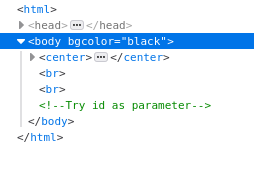

# So-simple

No estoy seguro si resolví este reto como se debería pues no tuve que hacer mucho LMAO...

En este reto se nos brindaba una página en blanco, sin embargo, lo verdaderamente interesante se encontraba 
como un comentario al inspeccionar la página.

Lo único que hice fue enviar el parametro como GET mediante la URL y jugar con los id hasta traerme uno que tenía la flag.
Desconozco si se trataba de un reto de SQL INJECTION en el que tenía que hacer otras cosas, sin embargo, sólo bastó ese paso
para obtener la flag.

