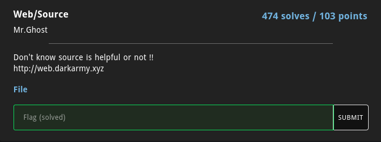
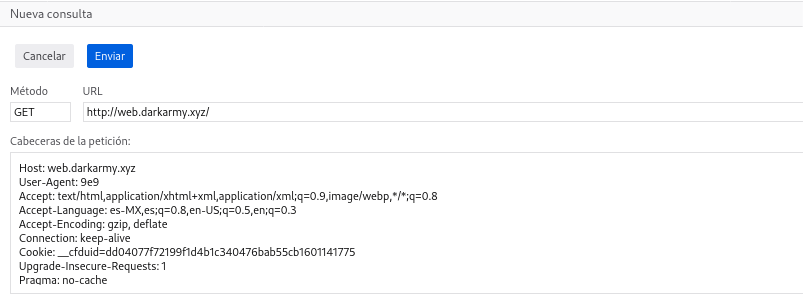
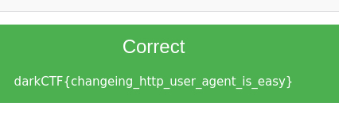

# Source

En este reto se nos daba una URL y un archivo con el código fuente de la página.

Para obtener la flag sólo necesitabas completar los tres condicionales dados:
* Que el dato que enviaras mediante el user agent fuera un valor númerico,
* Que su longitud de caracteres fuera menor que 4.
* Que el valor fuera mayor a 10,000.

Tuve una idea al empezar este reto y es que iba a intentar enviar nullbytes para burlar el filtro de que fueran menos de 4 caracteres, sin embargo, no había forma de burlar el primer filtro de que fuera númerico.

Después de leer la documentación oficial de PHP noté que la función is_numeric evalua también los exponentes. https://www.php.net/manual/es/function.is-numeric.php

Así fue como llegué a la solución del reto pues 9e9 cumple con ser un número, ser menor a 4 caracteres de longitud y ser mayor a 10,000. 

De esta forma obtuve la flag.

