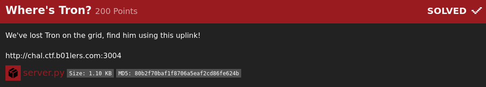
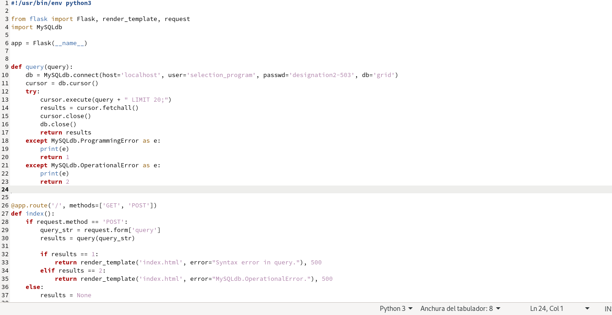
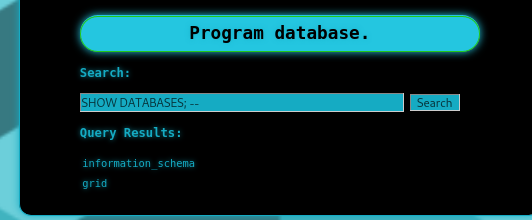
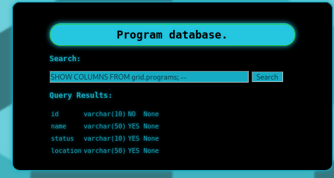
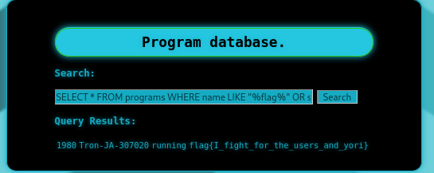

# Where Is Tron

Este reto fue muy divertido, ya hacía falta un reto de sql injection para ser sincero.
El reto era bastante simple, había una página que te permitía hacer consultas y te daban el código fuente para
encontrar la vulnerabilidad. Sólo bastaba en que tú crearas la consulta y a eso se le concatenaría " LIMIT 20; "
así que para que eso no nos diera problemas decidí comentar el resto de la consulta con el clásico " -- " de esta forma
ya no tendría límite en las consultas y podría hacerlo a mi manera.

Lo primero que hice fue mostrar las bases de datos.

Después obtuve las tablas.

Empecé a jugar con la información para traerme todos los datos, sin embargo, habían tablas como esta que traían más de 3000 registros.

Así que opté por obtener las columnas de la tabla que me faltaba por inspeccionar ya que esta tenía más información.

Y añadiendo LIKE '%flag%' a cada columna pude filtrar la información para traerme sólo el registro que pudiera tener la flag
y de esta forma obtuve la flag.

