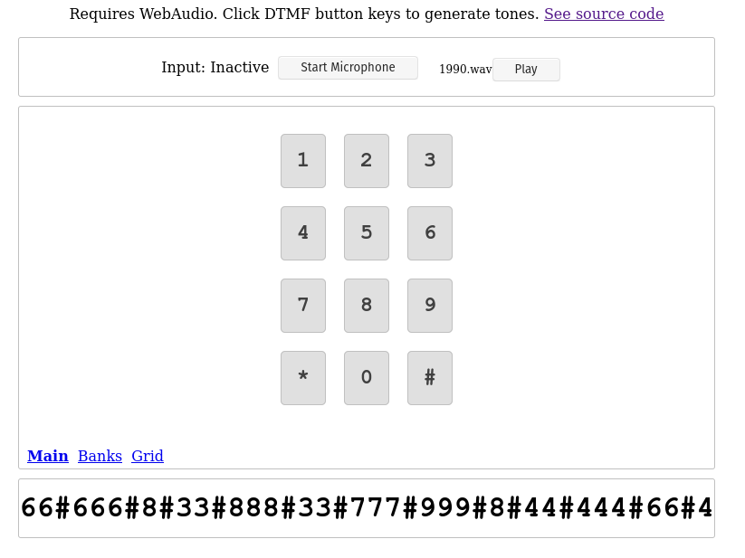
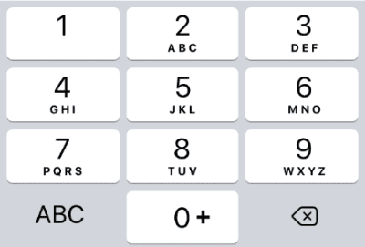

# 1990

## Description


This audio sounded like a telephone pad was being pressed.



So I looked for an online tool that would return the pressed numbers to me.



And then I only decoded them by hand pressing that number the number of times it was repeated to obtain the character.

```
66#666#8#33#888#33#777#999#8#44#444#66#4#666#66#7777#2#6#33#9#2#999#
noteverythingonsameway
```

## Remember us and remember that we lived

