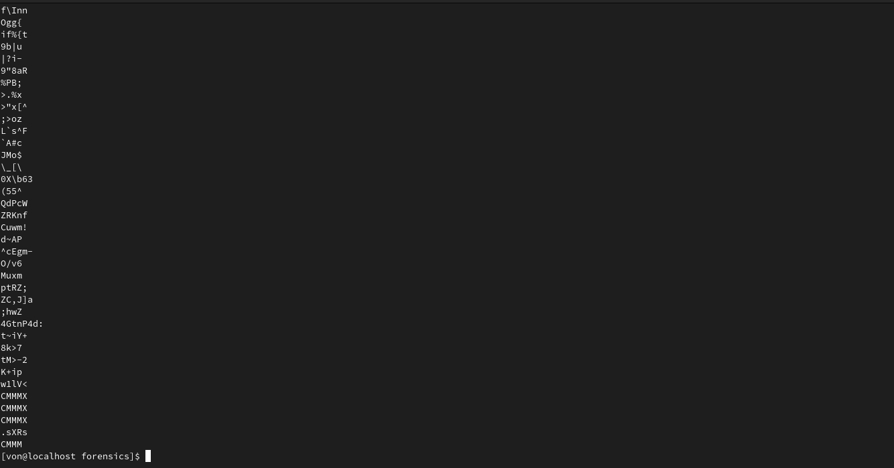
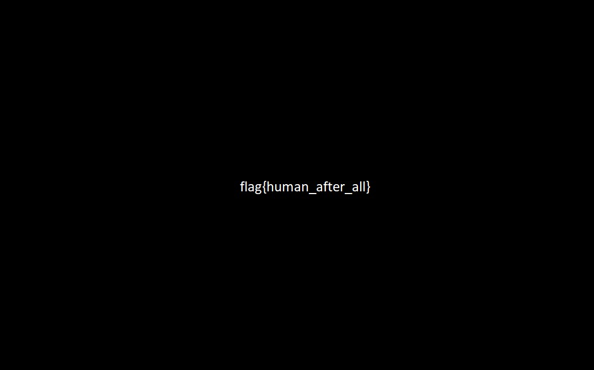

# Oppossable Thumbs

```
The flag is right between your finger tips.

Download the file below.
```

En este reto nos pedían descargar un archivo por lo que procedí con la rutina de forenses donde
utilicé strings, exiftool, etc, sin embargo, lo único interesante que encontré fue
que no se podía reconocer el archivo con exiftool así que supuse que tenía algo dentro.




Procedí a utilizar binwalk para ver si habían archivos ocultos dentro de este y me topé con un montón de archivos
por lo que procedí a extraerlos.


Entre esos archivos pude encontrar la flag.




