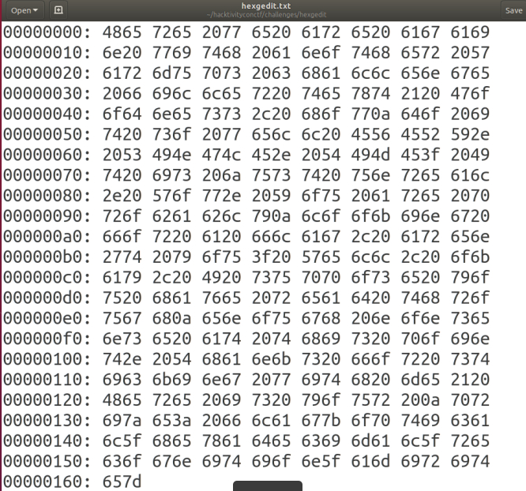

# Hexgedit

En este reto nos daban una imagen con valores en hexadecimal así que había dos formas de solucionar el reto,
pasar cada valor a ASCII para decodificar el mensaje o utilizar un poco más la lógica.
Sabemos que el formato de las banderas en este CTF empieza con "f" y que el valor de "f" en ASCII es 66 así que busqué
la línea que tenía el 66 y la encontré, era la 4 línea, ahí empezaría la flag, después sólo tuve que buscar
el valor de "}" el cual era 7d para decodificar desde la "f" hasta el "}" y así se obtenía la flag, aún así,
dejaré la decodificación del mensaje completo por si a alguien le interesa (método más largo).

