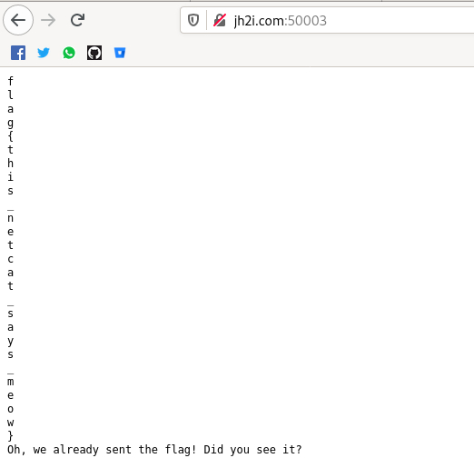

# Internet Cattos

No tengo idea de qué se trataba este reto más allá de que te daban la URL y el PUERTO pues a penas ingresabas a la dirección
ya te daban la flag. Siento que quizá se trataba de un reto donde tenías que saber como entrar a un puerto específico 
pero siento que de ser así el reto era bastante malo LOL...

