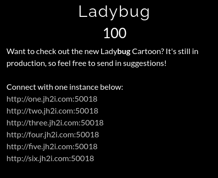
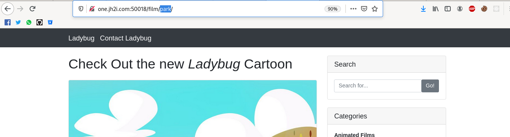
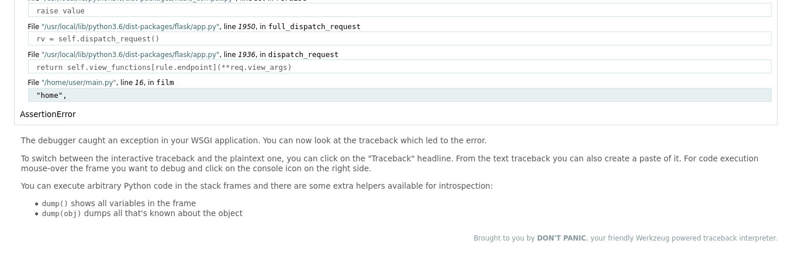
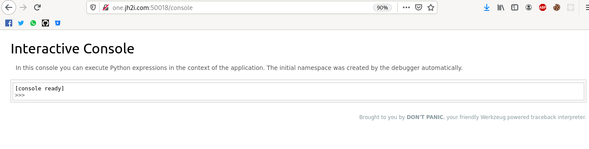
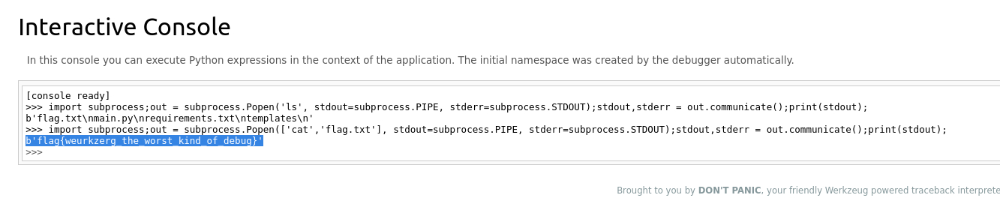

# Ladybug

De entrada era una página normal donde podías navegar entre diferentes categorías.

Después de hacer el recorrido por toda la página no encontré nada interesante por lo que decidí
acceder mediante la URL a algún recurso diferente de los mostrados.

Así fue como me topé con algo muy interesante. El sitio web fue hecho con Flask, un framework de Python.

Cuando navegué más abajo noté que se mencionaba un debugger así que me puse a investigar más acerca de esto.

Este mensaje se muestra debido a que al levantar el servidor se dejó el parametro de debug como True, y esto
supone un gran peligro pues sólo debe ser usado en desarrollo pero no en producción.

Werkzeug es una librería que permite hacer pruebas de muchos tipos.

Así que navegué a la consola de Werkzeug ubicada en /console.
Aquí se mencionaba que podías ejecutar expresiones de Python en el contexto de la aplicación.

Ya en este punto fue bastante sencillo obtener la flag, tan sólo creé un payload utilizando los subprocesos
de Python para ejecutar el comando ls para listar los archivos y luego usar el comando cat para traerme
el contenido de la bandera.

