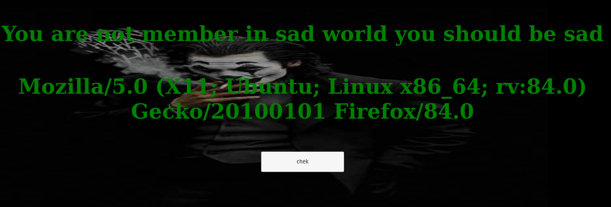
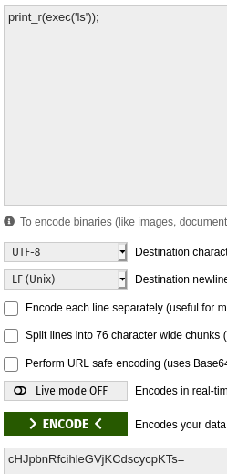
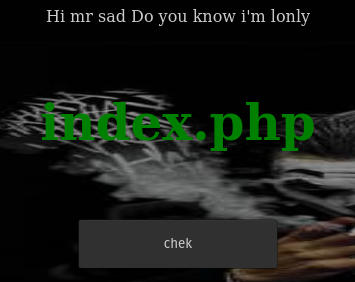
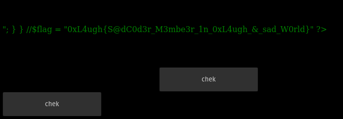

# Sad agent

## Description

As the name of the challenge indicates, this is a challenge about exploiting a vulnerability in the user agent.

So, when you try to use the check button it indicates that you are not "sad" showing my current user agent so i decided to send "sad" as a user agent to see what happens.

Again, the only thing that changed is that now it only printed the user agent but I noticed that a base64 encoded parameter was being sent so I proceeded to decode it.

And this seems to indicate that it was an "eval" challenge where the expression that we sent as a parameter would be evaluated, but it had to be encoded as base64 to be executed and printed.

So by coding the following code I got the names of the files at the folder level to confirm that it was possible to evaluate my expression.

Yeah, i did it... now it's time to get the flag.

## Remember us and remember that we lived

