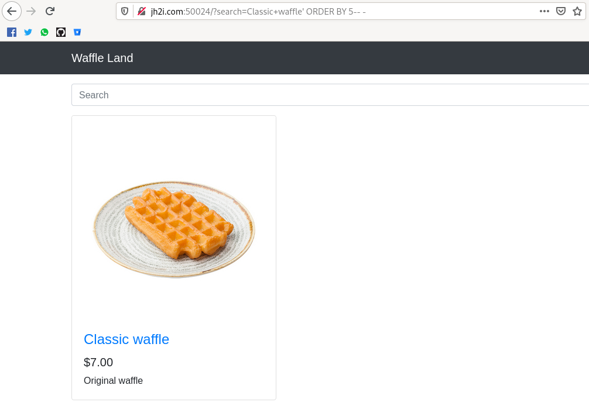
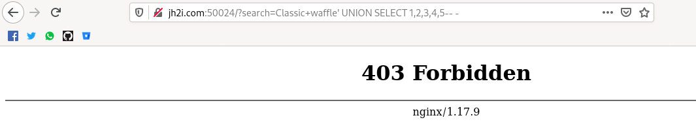
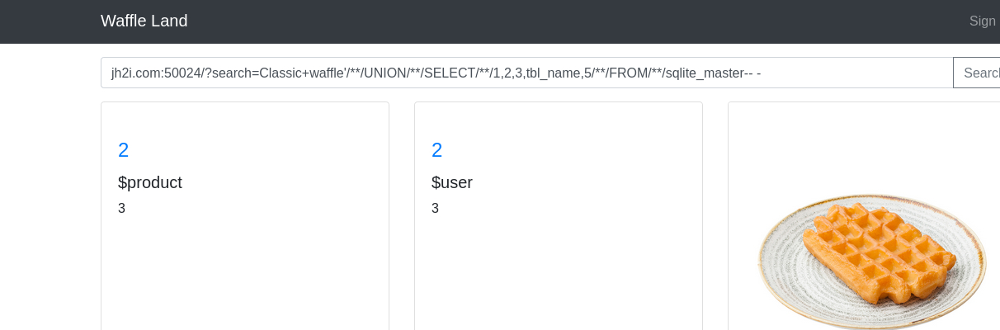
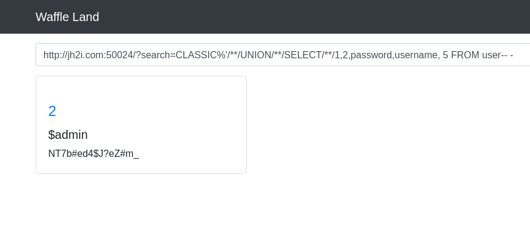
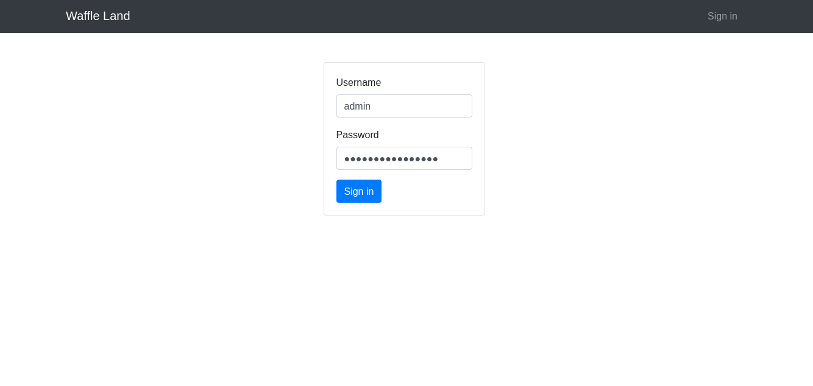

# Ladybug

Este reto se trataba de una página para buscar waffles mediante una barra de búsqueda.
Por lo que al inicio no fue difícil suponer que se trataba de un reto de SQL injection.

Esto lo comprobé de forma bastante sencilla, primero busqué un waffle en particular.

Después probé con el clásico ' OR 1=1-- - y terminó trayendo todos los resultados.

Intenté cortar la consulta mal para ver si me arrojaba un mensaje de error y me topé con lo siguiente.
Estaban utilizando sqlite y esto sería importante más adelante.

Si pueden notarlo la consulta es muy sencilla, están utilizando un LIKE para realizar una consulta dinámica
por lo que empecé a jugar con la consulta.

Como muchos saben el primer paso para traerme los datos de esta base de datos es saber el número de columnas que regresa,
intenté con 7 pero me arrojó un error así que fui bajando el número hasta dar con que retornaba 5 columnas.

Lo siguiente fue hacer el ataque mediante UNION SELECT, sin embargo, me apareció el mensaje de FORBIDDEN, 
había un WAF bloqueando este tipo de consultas así que empecé a buscar formas de bypassear un UNION SELECT.
Fue una larga búsqueda porque intenté muchas formas y sólo una me funcionó mediante el uso de comentarios /**/
los cuales generaban el espacio vacío en la consulta.

Ya en este punto después de haber bypasseado la consulta empecé a traerme las tablas de la base de datos.
Es importante recordar que se trata de sqlite, no de mysql por lo que debía traerle el nombre de las tablas
de sqlite_master.

Jugué mucho más con la consulta hasta traerme las columnas de la tabla de usuarios.

Ya sólo era cuestión de traerme el usuario y contraseña de la tabla de usuarios pues ya conocía el nombre de las columnas y el nombre de la tabla dando con las credenciales del administrador.

Con estos datos sólo me bastó iniciar sesión (no recordaba que estaba este panel arriba LMAO).

Así fue como obtuve la flag. Un reto bastante divertido y retador por el tema de las palabras bloqueadas
y el uso de sqlite para variar en lugar del clásico mysql.

